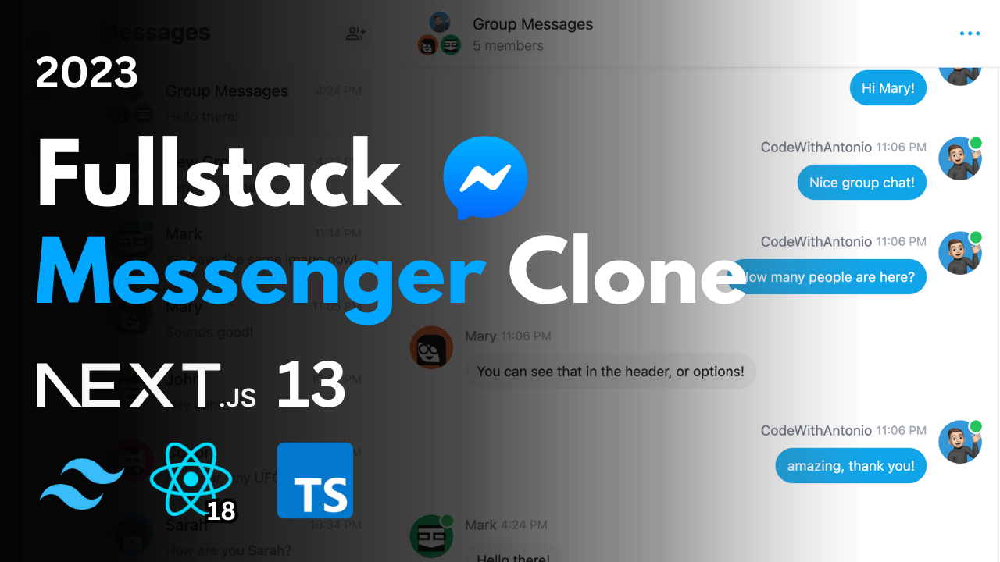

<div align="center">
  <h2 style="font-size:30px; font-weight: 700;">Real-Time Messenger App</h2>
</div>

<p align="center" style="margin-top: 35px; width: 100%" >
  
</p>

<div style="margin-top: 30px;"/>

## Sobre o Projeto
Esse projeto faz parte de uma série de exercícios que têm como objetivo explorar as novas funcionalidades do Next.js.
Para acompanhar o tutorial, você pode acessar o canal [Code With Antonio no YouTube](https://www.youtube.com/watch?v=PGPGcKBpAk8&ab_channel=CodeWithAntonio).

<div style="margin-top: 30px;"/>

## 🛠️ Recursos explorados:
Durante o tutorial, exploramos várias features do Next.js, incluindo:

- Fetch Data: Aprendemos como buscar dados em uma API utilizando o Next.js.
- Camadas app/api: Exploramos a estrutura do projeto em camadas, separando as responsabilidades da aplicação.
- Autenticação com NextAuth: Implementamos autenticação de usuários utilizando o NextAuth, uma biblioteca popular para autenticação no Next.js.
- Rotas: Demonstramos como criar rotas personalizadas e protegidas em uma aplicação Next.js.
- Responsividade: Trabalhamos na criação de uma interface responsiva utilizando o framework Tailwind CSS.
- Mensagens em tempo real com Pusher: Implementamos a funcionalidade de mensagens em tempo real utilizando o serviço Pusher.
- Alertas e notificações: Adicionamos alertas e notificações para melhorar a experiência do usuário.
- Upload de imagens com Cloudinary: Exploramos como fazer upload de imagens para a nuvem utilizando o serviço Cloudinary.
- Manipulação de erros: Aprendemos a lidar com erros e exceções de forma adequada no Next.js.


[Next.js](https://nextjs.org/), [React.js](https://react.dev), [Tailwind](https://tailwindcss.com), [Prisma](https://www.prisma.io), [MongoDB](https://www.mongodb.com), [NextAuth](https://next-auth.js.org), [Pusher](https://pusher.com)

<div style="margin-top: 30px;"/>

## 💻 Rodando o projeto

<div style="margin-top: 20px;"/>

### Prerequisites
**Node version 14.x**


```bash
# Instale as dependências
$ yarn install
# ou
$ npm install
```


### Configure arquivo .env com suas credencials:

```js
DATABASE_URL=
NEXTAUTH_SECRET=

NEXT_PUBLIC_PUSHER_APP_KEY=
PUSHER_APP_ID=
PUSHER_SECRET=

NEXT_PUBLIC_CLOUDINARY_CLOUD_NAME=

GITHUB_ID=
GITHUB_SECRET=

GOOGLE_CLIENT_ID=
GOOGLE_CLIENT_SECRET=
```


### Configure Prisma

```shell
npx prisma db push
```

### Execute a aplicação

```bash
$ yarn dev
# ou
$ npm run dev
```

<div style="margin-top: 20px; align:center; text-align: center; margin:0 auto">

Espero que você aproveite o tutorial e tenha uma experiência divertida e educativa ao explorar as novas funcionalidades do Next.js no projeto Next13.
</div>